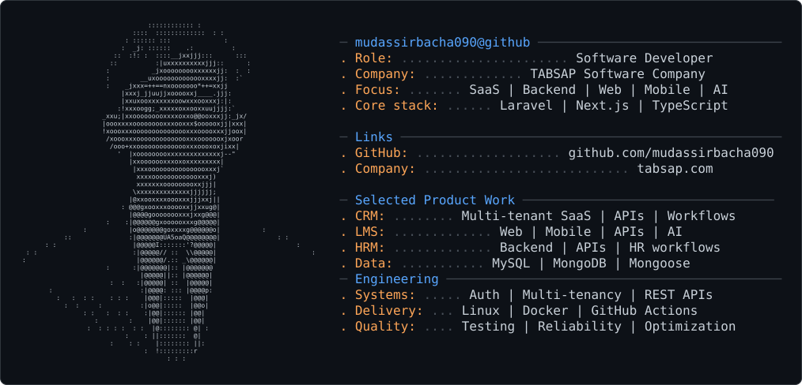

<picture>
  <source media="(prefers-color-scheme: dark)" srcset="dark_mode.svg">
  <source media="(prefers-color-scheme: light)" srcset="light_mode.svg">
  
</picture>

# Mudassir Bacha

### Software Developer @ [TABSAP Software Company](https://tabsap.com)

I build production software across SaaS, web, mobile, backend systems and AI-powered applications, with a focus on reliable architecture, scalable APIs and practical product engineering.

## Engineering Focus

- SaaS application development
- Backend & REST API development
- Web application development
- Mobile application development
- Database architecture
- Authentication & authorization
- AI / LLM integrations
- Linux & deployment
- Docker & infrastructure
- Production debugging & optimization

## Selected Product Work

### [TABSAP CRM](https://tabsap.com/products/tabsap-crm)

Business management SaaS platform.

**Engineering focus:** Multi-tenancy · APIs · Database · Business workflows · Mobile

### [TABSAP LMS](https://tabsap.com/products/tabsap-lms)

Learning management platform.

**Engineering focus:** Web · Mobile · APIs · AI integrations

### [TABSAP HRM](https://tabsap.com/products/tabsap-hrm)

Human resource management platform.

**Engineering focus:** Backend · APIs · Database · HR workflows

## Architecture

A conceptual view of the product platform:

```text
                         TABSAP PLATFORM
                                │
         ┌──────────────────────┼──────────────────────┐
         │                      │                      │
    TABSAP CRM             TABSAP LMS             TABSAP HRM
         │                      │                      │
         └──────────────────────┼──────────────────────┘
                                │
                      COMMUNICATION LAYER
                                │
               ┌────────────────┼────────────────┐
               │                │                │
              Chat           WhatsApp          Email
```

## Technology Stack

| Area | Technologies |
|---|---|
| **Backend** | PHP · Laravel · TypeScript · REST APIs |
| **Web** | Next.js · React · Bootstrap |
| **Mobile** | React Native · Expo |
| **Database** | MySQL · MongoDB · Mongoose |
| **Infrastructure** | Linux · Docker · GitHub Actions |
| **AI** | LLM integrations · Provider APIs |

## Selected Work

| Project | Engineering Work | Stack |
|---|---|---|
| [TABSAP CRM](https://tabsap.com/products/tabsap-crm) | Multi-tenant SaaS, APIs, business workflows | Laravel · PHP · MySQL · Redis |
| [TABSAP LMS](https://tabsap.com/products/tabsap-lms) | Learning platform, APIs, web/mobile product work | Next.js · TypeScript · MongoDB · React Native · Expo |
| [TABSAP HRM](https://tabsap.com/products/tabsap-hrm) | HR workflows, backend and data management | Laravel · PHP · MySQL |

## GitHub Activity

[View public repositories](https://github.com/mudassirbacha090?tab=repositories)

## Currently Building

I’m currently focused on multi-tenant SaaS, backend APIs, role-aware workflows, deployment reliability and AI features that solve concrete product problems.

## Connect

- [GitHub](https://github.com/mudassirbacha090)
- [TABSAP Software Company](https://tabsap.com)
